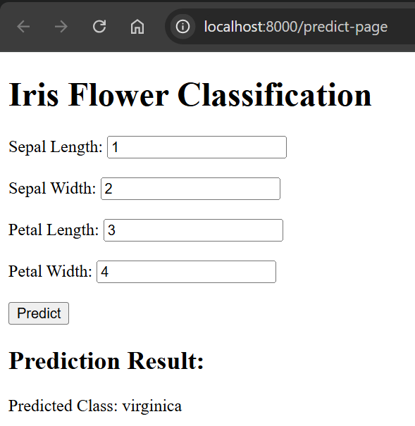

# mlclassificationapi
Deploy a trained ML model into a Docker container and create an API. 

Ez pz steps:

1. Download os python version. Each line in Dockerfile is executed.
```
docker build -t image_name .
```
2. Create container. (note: if container_name is already exist, delete them or use other name)
```
docker run --name container_name -p 8080:8080 image_name
```
3. Check uvicorn running on http://0.0.0.0:8080
Note: Otherwise, try below address
```
http://localhost:8080
```
```
http://127.0.0.1:8080
```
If u see like below, u are good to go


4. Next, check on docs at  http://0.0.0.0:8080/docs to explore and test
   


6. Try inside postman too
   

7. Can try in cmd
   

8. So API wouldnt be enough. static/index.html provide basic web app to receive input and display application. Then, simply execute command below and check http://localhost:8080/predict-page

```
uvicorn app.server:app --reload --host localhost --port 8080 

```



9. Perfect. Now to deploy in gcp. (note: make sure to enable API in API Library for Artifact Registry in gcp first)

a. After enabling the API, create credentials by creating service accounts. Then create a key in JSON file and save them in local computer. Make sure the Artifact Registry Writer role is associated with the service account

b. In terminal, set environment variable

```
$env:GOOGLE_APPLICATION_CREDENTIALS="C:/path/to/downloaded/key.json"
echo $env:GOOGLE_APPLICATION_CREDENTIALS  
```
*Note: make sure path is forward slash /

c. Use the service account JSON key to log in to Docker

```
cat $env:GOOGLE_APPLICATION_CREDENTIALS | docker login -u _json_key --password-stdin https://gcr.io
```
d. Build the Docker Image
```
docker build -t gcr.io/YOUR_PROJECT_ID/iris-model .
```
e. Push Docker Image
```
docker push gcr.io/YOUR_PROJECT_ID/iris-model
```
f. Deploy to Google Cloud Run

Cloud Run > Deploy Container > Service > select latest container image URL > 
Allow unauthenticated invocations > Create

Voila! kk bye
